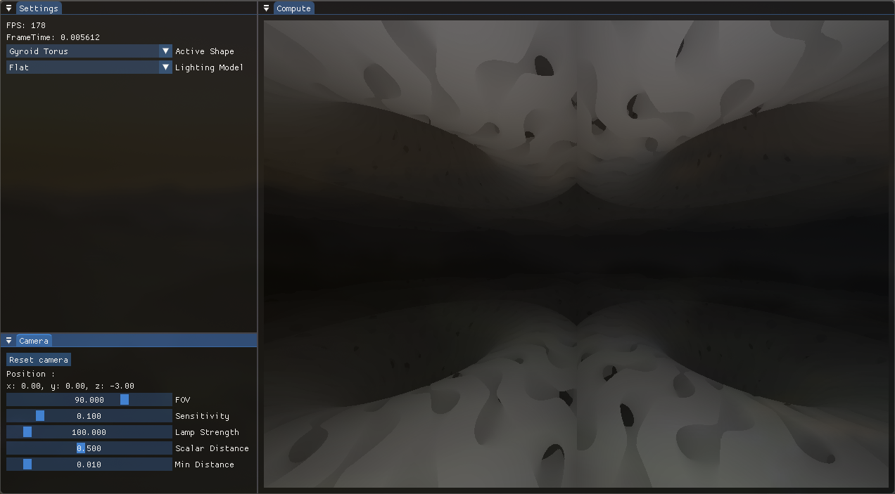
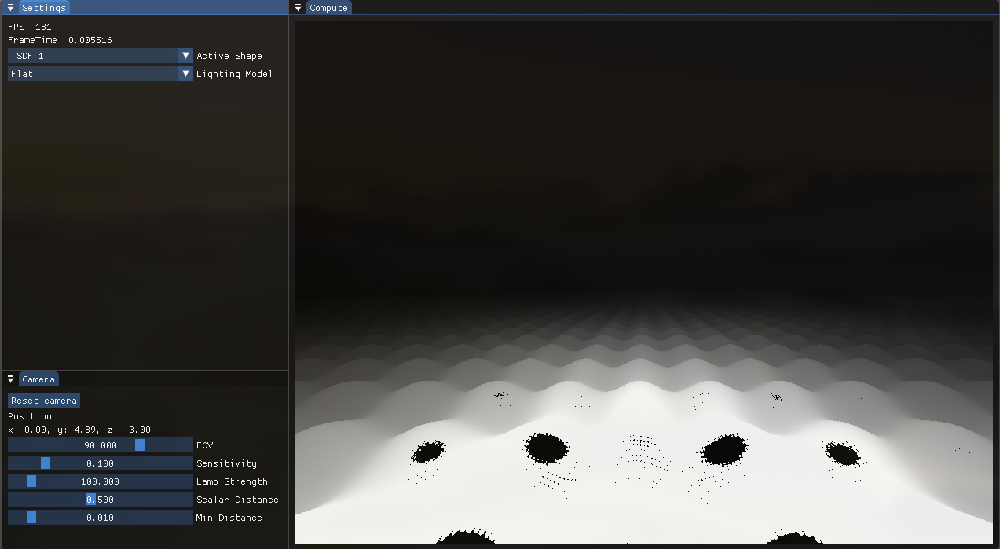
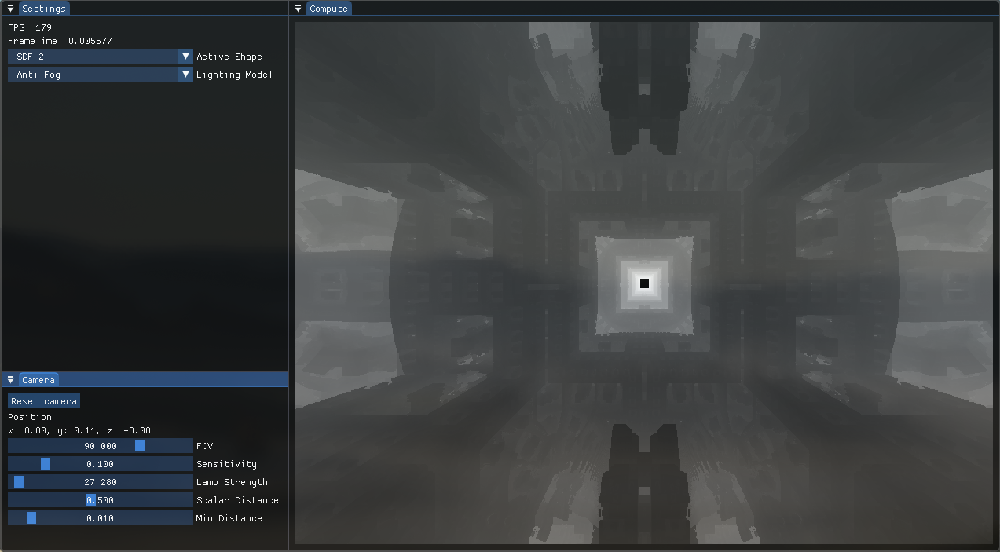
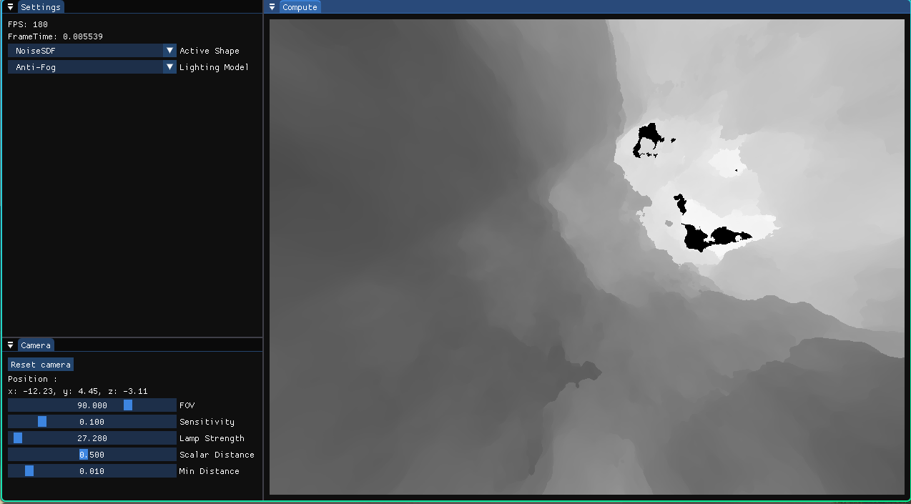

# SRPLightingEngine

A custom SDF (signed distance field) engine written in C++ and GLSL using a custom math library, OpenGL graphics API, and ImGui library.






## Build Instructions
### Linux

This project uses CMake so make sure you have that installed and that you are in the root of the project. Run this command in the root of the project and it should do everything for you.
```
./run.zsh
```
